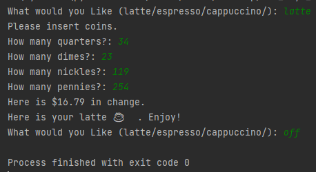

# Coffee Machine

### A simple coffee machine which asks for the type of coffee, Takes Coins, Dispenses Coffee and then Returns the Change.
## Summary
### Coffee Machine Project was a little Challenging, This Project made me familiar with the Concept of OOPS(Object Oriented Programming)
###Object-oriented programming is a programming paradigm based on the concept of "objects", which can contain data and code.